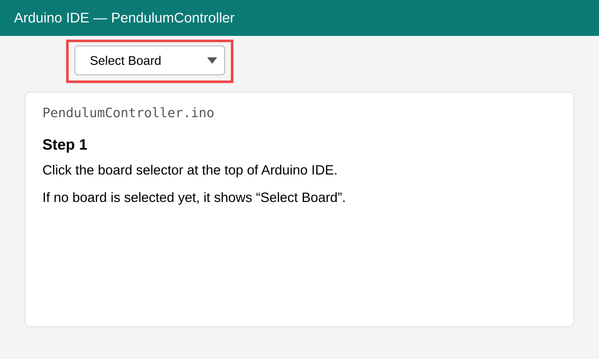
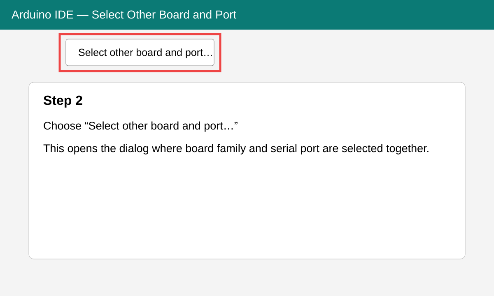
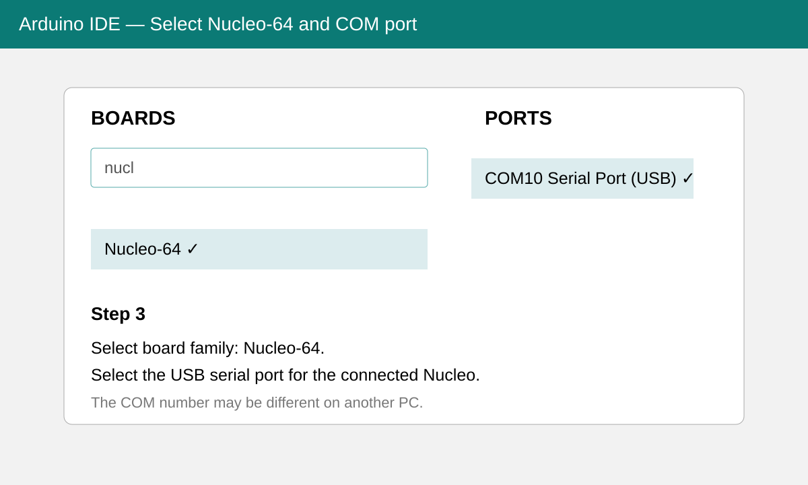
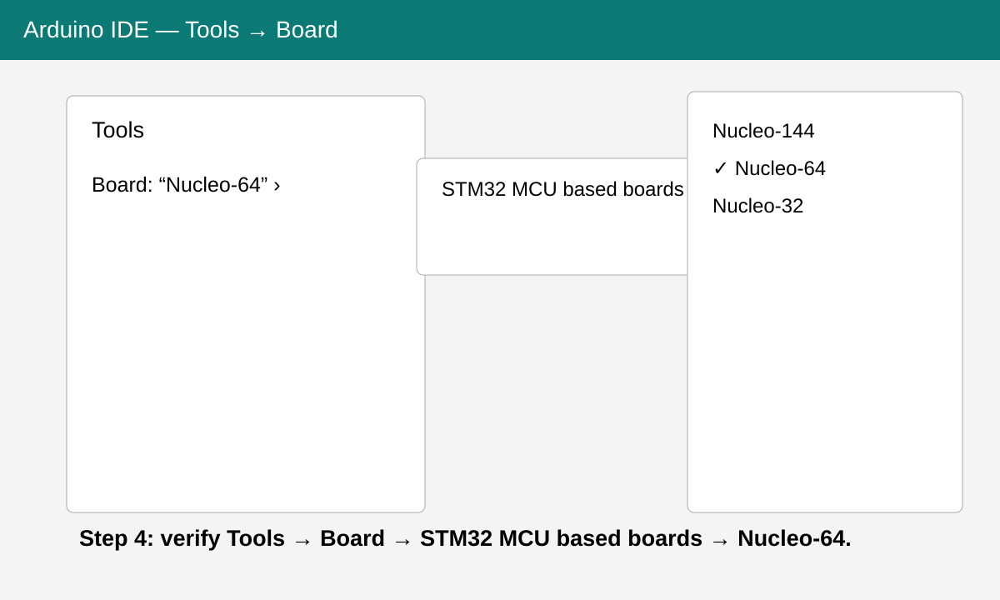
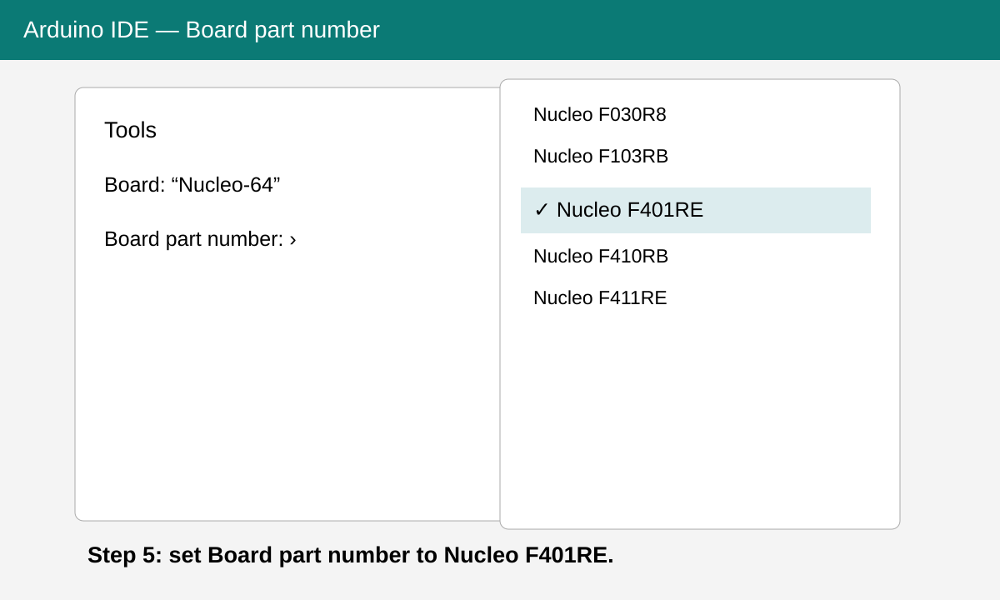

# Arduino IDE setup for NUCLEO-F401RE

This project is written for the **STMicroelectronics NUCLEO-F401RE** used with the STEVAL-EDUKIT01 / X-NUCLEO-IHM01A1 stepper-motor hardware.

The screenshots used to prepare this guide were taken with Arduino IDE 2.3.6. The menu layout can vary slightly with other Arduino IDE or STM32 core versions.

## Hardware connection

1. Connect the NUCLEO-F401RE to the computer with the USB connector used for ST-LINK programming/debugging and board power.
2. Windows should expose a serial/USB device. In the screenshots the board appears on `COM10`, but **the COM number is computer-specific and may be different**.
3. Keep the X-NUCLEO-IHM01A1 / L6474 motor shield mounted and wire motor power separately as required by the hardware. USB alone is not the motor power source.

Before uploading, make sure no Jupyter notebook, Python process, or Serial Monitor is holding the COM port open.

## Required Arduino board package

Install the STM32 Arduino core first if it is not already installed:

- Arduino IDE → **Tools → Board → Boards Manager...**
- Search for the STM32 MCU board package from STMicroelectronics and install it.

The correct selection for this repository is:

- **Board family:** `Nucleo-64`
- **Board part number:** `Nucleo F401RE`

Do not select `Nucleo-144`, `Nucleo-32`, or another F4 part number merely because it is also an STM32 board.

## If STM32 does not appear in Boards Manager

If the STM32 board package does not appear in **Boards Manager**, the most common cause is that the STM32 Boards Manager URL has not been added, or an old URL is still being used.

For Arduino IDE 2.x:

1. Open **File → Preferences**.
2. Add the following URL to **Additional Boards Manager URLs**:

```text
https://github.com/stm32duino/BoardManagerFiles/raw/main/package_stmicroelectronics_index.json
```

3. Click **OK** and restart Arduino IDE.
4. Open **Tools → Board → Boards Manager...**.
5. Search for:

```text
STM32
```

6. Install:

```text
STM32 MCU based boards
by STMicroelectronics
```

If STM32 still does not appear:

- Make sure there are no spaces before or after the Boards Manager URL.
- Remove or replace obsolete STM32 package-index URLs if one was configured previously.
- Check whether a company, school, proxy, VPN, firewall, or security product is blocking access to `github.com` or `raw.githubusercontent.com`.
- Clear the Boards Manager search field completely and search for `STM32` again.
- Restart Arduino IDE after changing **Additional Boards Manager URLs**.
- Prefer a current Arduino IDE 2.x release.

After the STM32 core is installed, select **Nucleo-64 → Nucleo F401RE** before compiling or uploading this project's firmware.

## Step 1 — open the board selector

Click the board selector at the top of Arduino IDE. When no board is selected it displays **Select Board**.



## Step 2 — choose another board and port

Select **Select other board and port...**.



## Step 3 — choose Nucleo-64 and the USB serial port

In the board search field, typing `nucl` is enough to locate the Nucleo families.

Select:

- `Nucleo-64`
- the serial port belonging to the connected board

The example screenshot shows `COM10 Serial Port (USB)`. Your machine can show `COM3`, `COM7`, `COM11`, etc.



A simple way to identify the correct port is to disconnect the Nucleo, note which COM port disappears, and reconnect it.

## Step 4 — verify the board family from Tools

You can verify the selection through:

**Tools → Board → STM32 MCU based boards → Nucleo-64**



## Step 5 — select the exact MCU board

After selecting `Nucleo-64`, set:

**Tools → Board part number → Nucleo F401RE**



This is the important final check. `Nucleo-64` describes the board family/form factor; **`Nucleo F401RE` is the exact board used by this project.**

## Recommended Tools settings

The screenshots show the following working selections for the NUCLEO-F401RE setup:

| Arduino IDE option | Selection |
|---|---|
| Board | `Nucleo-64` |
| Board part number | `Nucleo F401RE` |
| Upload method | `Mass Storage` |
| USB support (if available) | `None` |
| U(S)ART support | `Enabled (generic 'Serial')` |
| Port | the COM port associated with your Nucleo, e.g. `COM10` |

The firmware in this repository uses `Serial` for the newline-delimited JSON protocol, so keeping generic serial/UART support enabled is important.

## Required libraries

For `PendulumController/PendulumController.ino`, install libraries compatible with the STM32 Arduino core:

- `STM32duino X-NUCLEO-IHM01A1`
- `RotaryEncoder`
- `ArduinoJson` v6

Arduino IDE → **Tools → Manage Libraries...** can be used to install them.

## Compile and upload

1. Open `PendulumController/PendulumController.ino`.
2. Confirm `Nucleo-64` / `Nucleo F401RE` and the correct COM port.
3. Click **Verify** first.
4. If compilation succeeds, click **Upload**.
5. Close Arduino Serial Monitor before running the Jupyter/Python controller because only one application should own the serial port at a time.

## Serial settings used by this repository

The firmware communicates at:

```text
500000 baud
```

The Python/Jupyter code must use the same COM port and baud rate.

Example:

```python
SERIAL_PORT = "COM10"   # change for your PC
BAUD_RATE = 500000
```

## Common problems

### `Nucleo F401RE` does not appear

See **[If STM32 does not appear in Boards Manager](#if-stm32-does-not-appear-in-boards-manager)** above. Install or update the STMicroelectronics STM32 core first, then select `Nucleo-64` and `Nucleo F401RE`.

### Upload succeeds but Python cannot open the COM port

Close Arduino Serial Monitor/Serial Plotter and any other Python/Jupyter kernel that may already have the port open.

### Wrong board was selected

Selecting only `Nucleo-64` is not enough. Check **Tools → Board part number → Nucleo F401RE**.

### COM port changes

Windows can assign a different COM number after reconnecting the board or using another USB port. Update `SERIAL_PORT` in the notebook accordingly.

### Motor does not move even though upload is successful

Board/USB power and motor power are separate concerns. Verify the L6474 board motor supply, motor phase wiring, current setting, and the IHM01A1 connections. Do not increase motor current blindly; confirm the motor rating first.
