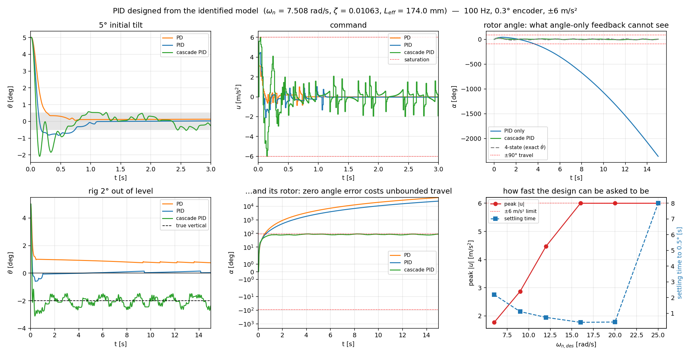

# 동정 계수로 PID 제어기 설계하고 시뮬레이션으로 확인하기

자유 진동 실험에서 얻은 값만으로 직립 밸런싱 PID 를 **닫힌 형태로** 설계하고, 그 설계가
실제 장비의 제약(100 Hz 루프, 0.3° 엔코더, ±6 m/s², 건마찰, 유한한 로터 행정) 아래에서
버티는지 확인한다. 손으로 튜닝한 게인은 이 문서에 하나도 없다.

- 코드: [`../analysis/design_pid.py`](../analysis/design_pid.py) — 아래 표와 그림을 전부 생성한다
- 설계식·제어기: [`../pendulum_sim.py`](../pendulum_sim.py) 의 `place_pid()`, `CascadePID`, `cascade_from_4state()`
- 모델 출처: [`pendulum_model_identification.md`](pendulum_model_identification.md)

```bash
cd analysis
python design_pid.py             # 표 + design_pid.png
```

---

## 1. 설계가 출발하는 플랜트

동정에서 나온 값 **그대로**다.

| 값 | 기호 | 출처 |
| --- | --- | --- |
| 7.5080 rad/s | $\omega_n$ | 극값 간격 회귀 |
| 0.010629 | $\zeta$ | 포락선 피팅 |
| 0.0798 1/s | $\sigma = \zeta\omega_n$ | 위 두 값 |
| 0.17397 m | $L_{\text{eff}} = g/\omega_n^2$ | $\omega_n$ 에서 유도 |

직립 근처에서 선형화하면 ($\theta$ 는 직립 기준, $u$ 는 피벗 가속도)

$$\ddot\theta = \omega_n^2\,\theta - 2\sigma\,\dot\theta - \frac{u}{L_{\text{eff}}}$$

입력 이득 $-1/L_{\text{eff}} = -5.748$ 까지 **자유 진동만으로 결정된다**. 추가 실험이 필요 없다.

개루프 극점은

$$s = -\sigma \pm \sqrt{\sigma^2 + \omega_n^2} = +7.4286,\ -7.5882\ \mathrm{1/s}$$

불안정 극점 $+7.43$ 은 오차를 **93 ms 마다 두 배로** 키운다. 이것이 전체 시간 예산이다.

---

## 2. 설계식

PID 는 $u = k_p e + k_i \int e + k_d \dot e$, $e = \theta$. 적분기가 상태를 하나 더하므로
닫힌 루프는 **3차**다.

$$s^3 + \left(2\sigma + \frac{k_d}{L}\right)s^2 + \left(\frac{k_p}{L} - \omega_n^2\right)s + \frac{k_i}{L} = 0$$

원하는 다항식 $(s^2 + 2\zeta_d\omega_d s + \omega_d^2)(s + \omega_i)$ 와 계수를 맞추면

$$\boxed{
\begin{aligned}
k_d &= L\,(2\zeta_d\omega_d + \omega_i - 2\sigma) \\
k_p &= L\,(\omega_d^2 + 2\zeta_d\omega_d\,\omega_i + \omega_n^2) \\
k_i &= L\,\omega_d^2\,\omega_i
\end{aligned}}$$

우변에 있는 것은 전부 측정값이다. `place_pid()` 가 이 세 줄이다.

### 사양과 게인

$\omega_d = 12$ rad/s (개루프 불안정 극점의 약 1.6 배), $\zeta_d = 0.8$, 적분기 극점
$\omega_i = 4$ rad/s (지배 극점의 1/3).

| | $k_p$ | $k_i$ | $k_d$ |
| --- | --- | --- | --- |
| PD ($\omega_i = 0$) | 34.858 | 0 | 3.312 |
| **PID** | **48.219** | **100.206** | **4.008** |

단위는 rad 당 m/s². 검증:

```
closed-loop poles : [-9.6+7.2j  -9.6-7.2j  -4.0+0j]
requested         : -9.600 +- 7.200j,  -4.000
```

$\omega_i = 0$ 으로 두면 `place_poles()` 의 2상태 게인과 **정확히 일치**한다
($k_p = -k_1$, $k_d = -k_2$ — 부호 규약만 다르다).

---

## 3. 응답 — 5° 기울기에서 출발

| 제어기 / 루프 | 정착 | 마지막 1 s $\vert\theta\vert$ | 최대 $u$ | 포화 | 로터 |
| --- | --- | --- | --- | --- | --- |
| PD, 이상적 루프 | 0.29 s | 0.053° | 3.04 | 0 % | 2620° |
| PID, 이상적 루프 | 0.71 s | 0.021° | 4.22 | 0 % | 443° |
| PD, 100 Hz / 0.3° / 6 m/s² | 0.28 s | 0.068° | 3.10 | 0 % | 1069° |
| **PID, 100 Hz / 0.3° / 6 m/s²** | **0.74 s** | **0.150°** | **4.47** | 0 % | **675°** |

**엔코더 양자화와 100 Hz 샘플링은 거의 공짜다.** 이상적 루프와 현실적 루프의 차이가
0.1° 수준이다. 문제는 마지막 열이다 — 로터가 675° 흘러간다. 6절에서 다룬다.

---

## 4. 지배 극점을 얼마나 빠르게 잡을 수 있나

| $\omega_{d}$ | $k_p$ | $k_d$ | $k_i$ | 정착 | 최대 $u$ | 포화 |
| --- | --- | --- | --- | --- | --- | --- |
| 6 | 19.41 | 1.99 | 12.53 | 2.19 s | 1.77 | 0 % |
| 9 | 31.41 | 3.00 | 42.27 | 1.11 s | 2.87 | 0 % |
| **12** | 48.22 | 4.01 | 100.21 | **0.74 s** | 4.47 | 0 % |
| 16 | 78.10 | 5.35 | 237.53 | 0.42 s | **6.00** | 0 % |
| 20 | 116.51 | 6.70 | 463.92 | 0.44 s | 6.00 | 1 % |
| 25 | 176.53 | 8.38 | 906.09 | **7.99 s** | 6.00 | 48 % |

한계를 정하는 것은 샘플링이 아니라 **구동기 권한 ±6 m/s²** 다. 16 rad/s 부터 명령이 한계에
닿고, 25 rad/s 에서는 시간의 48 % 를 포화 상태로 보낸다 — 그때는 설계한 선형 제어기가 아니라
bang-bang 제어기이고, **정착이 오히려 느려진다(8 s)**. 12 rad/s 는 권한의 25 % 를 외란용으로
남긴다.

---

## 5. 적분기가 하는 일, 그리고 그 함정

장비가 2° 기울어져 있다고 하자. 이는 일정 토크로 들어온다.

$$d = \omega_n^2 \sin\phi = 1.967\ \mathrm{rad/s^2}$$

PD 이론값: 정상상태 오차 $= \omega_n^2\phi/\omega_d^2 = 0.783°$.

| 제어기 | 마지막 $\theta$ | 로터 최대 | 로터 끝 |
| --- | --- | --- | --- |
| PD (적분기 없음) | 0.772° | 42685° | 42685° |
| PID | **0.047°** | 23476° | 23476° |

적분기는 약속한 일을 정확히 해낸다(0.77° → 0.05°). **그리고 그것이 함정이다.**

장비가 기울어져 있으면 $\theta = 0$ 은 평형점이 **아니다**. 거기 서 있으려면

$$u = L\,d = 0.342\ \mathrm{m/s^2}$$

를 영원히 유지해야 하고, $u$ 는 로터 각도로 **두 번 적분**된다. 진짜 연직은 $\theta = -\phi$,
즉 $u = 0$ 인 곳에 있다. 측정 각도를 0 으로 몰아붙이는 것은 중력과 영원히 싸우는 일이고,
그 대가는 로터 행정이다 (42685° = 118 바퀴).

> 각도만 되먹이는 제어기는 PD 든 PID 든 이 사실을 **볼 수 없다.** 로터를 보지 않기 때문이다.

---

## 6. 로터: 바깥 루프를 닫는다

$$\theta_{\text{setpoint}} = -(k_\alpha\,\alpha + k_{\dot\alpha}\,\dot\alpha)$$

로터를 되돌리려면 진자를 **반대쪽으로** 먼저 기울여야 한다(비최소위상). 미분을 **측정값**에
대해 취하고 전개하면 이것은 그냥 4상태 되먹임이다.

$$u = k_p\theta + k_d\dot\theta + k_p k_\alpha\,\alpha + k_p k_{\dot\alpha}\,\dot\alpha$$

> **미분은 오차가 아니라 측정값에 대해 취해야 한다.** 오차에 대해 미분하면 움직이는
> setpoint 의 미분에 $\ddot\alpha = u/r$ 이 들어가 $u$ 가 자기 자신으로 되먹여진다.
> 대수 루프 이득이 $k_d k_{\dot\alpha}/r = 1.77$ 로 1 을 넘는다.
>
> | 미분 대상 | 마지막 $\vert\theta\vert$ | 로터 최대 |
> | --- | --- | --- |
> | 오차 (교과서 PID) | 12.30° | 322.9° |
> | **측정값** | **0.55°** | **24.7°** |
>
> 필터가 있으면 형식적으로 발산하지는 않지만 ±9~17° 로 헌팅하며(필터가 무거울수록 악화)
> 균형을 잡지 못한다. 상수 setpoint 에서는 두 방식이 같기 때문에, 이 버그는 캐스케이드를
> 붙이기 전까지 드러나지 않는다.

### 바깥 게인은 자유롭지 않다

준정적 논리($k_\alpha = \omega_o^2 r/g$, "바깥 루프는 안쪽의 1/6 속도로")로 고른 값들:

| 바깥 $\omega_o$ | $k_\alpha$ | $k_{\dot\alpha}$ | 마지막 $\vert\theta\vert$ | 로터 | 닫힌 루프 극점 실수부 |
| --- | --- | --- | --- | --- | --- |
| 0.5 | 0.00217 | 0.00780 | 0.27° | 54.3° | −19.7, −13.4, −0.71, −0.49 |
| 1.0 | 0.00867 | 0.01560 | 0.31° | 31.2° | −12.9, −12.9, −1.81, −0.88 |
| 2.0 | 0.03467 | 0.03120 | 0.59° | 24.1° | −5.46, −5.46, −4.38, −1.63 |
| 3.0 | 0.07801 | 0.04680 | 3.32° | 23.5° | −5.6, −2.33, **+1.28, +1.28** ← 넘어짐 |
| 4.0 | 0.13868 | 0.06241 | 3.40° | 27.9° | −6.06, −3.03, **+7.63, +7.63** ← 넘어짐 |
| **배치** | 0.02397 | 0.02164 | 0.55° | 24.7° | −10, −10, −2, −2 |

$\omega_o \approx 2$ rad/s 를 넘으면 극점 쌍이 우반평면으로 넘어가 진자가 쓰러진다.
준정적 경험칙(안쪽 12 rad/s 의 1/6 = 2 rad/s)은 그 경계 **바로 안쪽**에 여유 없이 착지한다.
네 극점을 한꺼번에 배치하라는 근거가 이것이다 — `cascade_from_4state()`.

### 미분 필터도 공짜가 아니다

| $\tau_d$ | 마지막 $\vert\theta\vert$ | 로터 | |
| --- | --- | --- | --- |
| 0 ms | 0.31° | 26.3° | |
| 5 ms | 0.61° | 25.0° | |
| **10 ms** | **0.55°** | **24.7°** | ← 채택 (제어 주기 1개) |
| 20 ms | 3.60° | 30.6° | ← ±3.6° 로 헌팅 |
| 40 ms | 7.76° | 56.8° | ← 헌팅 |

로터 속도까지 되먹이고 나면 20 ms 필터는 위상을 너무 많이 먹는다. 0.3° 엔코더를 100 Hz 로
차분할 때의 잡음 30 deg/s 를 누르는 데는 **한 제어 주기(10 ms)면 충분하다**.

> 이것은 [`pendulum_simulator.md`](pendulum_simulator.md) 6.1 절보다 엄격한 결과다.
> 거기서는 $\tau_d = 20$ ms 가 100 Hz 에서 통과했지만(0.850°), 그 실험은 로터 속도도 같은
> 필터를 거쳤다. 로터 속도를 정확히 아는 경우(스텝 카운트에서 나오므로 실제로 그렇다)
> 20 ms 는 오히려 불리하다.

### 최종 비교

$\{-10\pm10j,\ -2\pm j\}$ 배치, 100 Hz, 0.3° 엔코더, ±6 m/s², $\tau_d = 10$ ms:

```
kp = 62.919   ki = 0   kd = 6.934   k_alpha = 0.02397   k_alpha_dot = 0.02164
```

| 제어기 | 마지막 $\vert\theta\vert$ | 최대 $u$ | 로터 최대 | 로터 끝 |
| --- | --- | --- | --- | --- |
| 각도만 보는 PID | 0.039° | 4.47 | **2361°** | −2361° |
| **캐스케이드 PID** | 0.551° | 6.00 | **24.7°** | 2.7° |
| 4상태 되먹임 (참 $\dot\theta$, 참고용) | 0.833° | 5.90 | 26.2° | 2.3° |

캐스케이드는 4상태 기준선과 같은 성능을 내면서 **하드웨어가 실제로 가진 것만** 쓴다 —
양자화된 각도를 차분해서 필터링한 값. 기준선 행은 참 속도를 받은 결과다.

---

## 7. 같은 2° 기울기, 바깥 루프를 닫고

| 제어기 | 마지막 $\theta$ | 로터 최대 | 로터 끝 |
| --- | --- | --- | --- |
| 각도만 보는 PID | 0.047° | 23476° | 23476° |
| **캐스케이드 PID** | **−2.25°** | 92.3° | 85.1° |

캐스케이드는 **측정 0 이 아니라 진짜 연직**($-\phi$)에 정착하고, 로터를 흘려보내는 대신
세워 둔다. 주차 각도는 대략

$$\alpha_{\text{park}} \approx \frac{\phi}{k_\alpha} = \frac{2°}{0.02397} \approx 83°$$

측정으로 확인한 값 (25 s):

| 기울기 $\phi$ | 정착 $\theta$ | 로터 주차 | $\phi/k_\alpha$ |
| --- | --- | --- | --- |
| 0.5° | −0.32° | 20.3° | 21° |
| 1.0° | −1.05° | 47.9° | 42° |
| 2.0° | −2.25° | 85.1° | 83° |
| 3.0° | −2.95° | 124.3° | 125° |

$\theta$ 는 $-\phi$ (진짜 연직) 로, 로터는 $\phi/k_\alpha$ 로 — 예측과 측정이 일치한다.

±90° 행정에서 **2° 기울기가 행정을 거의 다 먹는다.** 결론은 제어기가 아니라 설치다 —
**장비를 수평으로 맞춰라.** 영원히 가속해야만 유지할 수 있는 바이어스를 제어기에게
맡기지 말 것.

---

## 8. 하드웨어에 올릴 때

1. **각도만 보는 PID 로 시작하지 말 것.** 시뮬레이션에서는 0.04° 로 아름답게 서 있지만
   로터가 2361° 감긴다. ±90° 행정에서는 몇 초 만에 끝난다.
2. **캐스케이드(= 4상태) 로 갈 것.** `cascade_from_4state(p, [-10±10j, -2±j])`.
3. **$\tau_d$ 는 한 제어 주기.** 100 Hz 면 10 ms. 20 ms 는 헌팅한다.
4. **미분은 측정값에 대해.** setpoint 가 움직이는 순간 오차 미분은 헌팅한다 (±12°).
5. **수평을 맞출 것.** 2° 기울기 = 로터 83° 주차.
6. $r = 85$ mm 는 **측정값이 아니다.** $k_\alpha,\ k_{\dot\alpha}$ 의 절대 크기는 $r$ 에
   비례하므로 실제 팔 반지름을 재서 넣어야 한다. $k_p,\ k_d$ 는 $r$ 과 무관하다.

---

## 9. 한계

- 5절의 "2° 기울기" 는 일정 토크 외란으로 모사한 것이다. 엔코더 영점 오차도 같은 증상을
  만들지만 수식은 다르다(측정 바이어스 대 플랜트 토크). 결론 — 각도를 0 으로 몰면 로터가
  흐른다 — 은 양쪽 모두에 해당한다.
- 플랜트는 [`pendulum_simulator.md`](pendulum_simulator.md) 6.2 절의 한계를 그대로 물려받는다:
  진자만 모델링하고, 원심력·코리올리 항이 없고, 스테퍼의 가속 한계와 탈조가 없다.
- 캐스케이드의 마지막 $\vert\theta\vert$ 가 0.5° 근처에서 완전히 0 이 되지 않는 것은
  건마찰 때문이다. 정지 마찰 대역 안에서 미세한 리밋 사이클이 남는다 —
  [`pendulum_simulator.md`](pendulum_simulator.md) 7.2 절.


