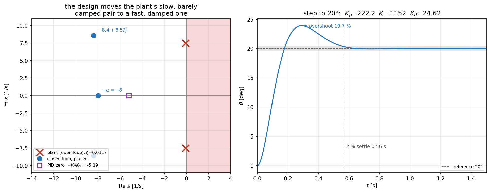
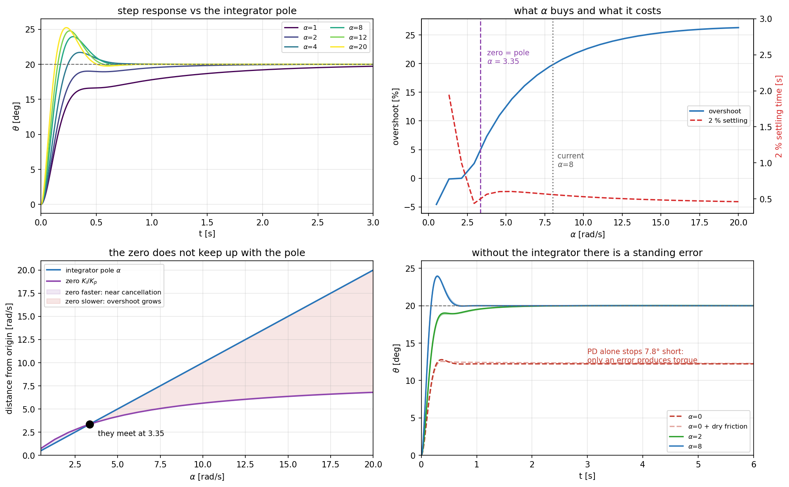
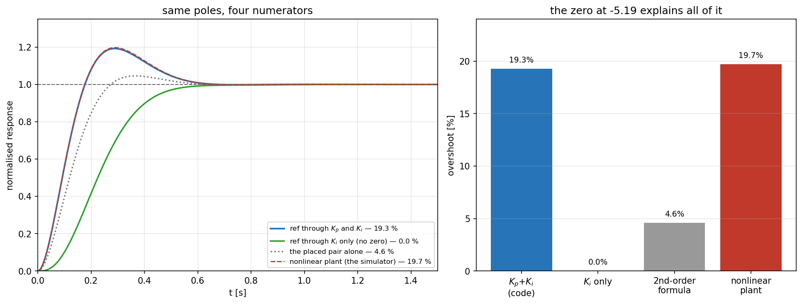
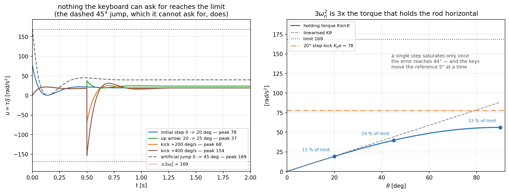

# PID 게인은 어디서 나오는가 — 극점 배치 세 줄

[`pid_pendulum_realtime.py`](pid_pendulum_realtime.py) 30–32 행:

```python
KD = J * (2 * ZETA_DES * WN_DES + ALPHA) - C
KP = J * (WN_DES ** 2 + 2 * ALPHA * ZETA_DES * WN_DES) - K
KI = J * ALPHA * WN_DES ** 2
```

튜닝한 값이 아니라 **원하는 닫힌 루프 극점에서 역산한 값**이다. 이 문서는 그 유도와,
세 설계 파라미터 `wn_des = 12.0`, `zeta_des = 0.7`, `alpha = 8.0` 이 각각 무엇을 정하는지,
그리고 포화 한계 `|u| ≤ 3·wn²` 의 의미를 정리한다.

---

## 1. 플랜트와 정규화

```python
J, K = 1.0, WN ** 2          # K = k/J = wn^2      = 56.235 1/s^2
C = 2 * ZETA * WN            # C = c/J = 2 zeta wn = 0.1758 1/s
```

$$J\ddot\theta + c\,\dot\theta + k\sin\theta = \tau$$

자유 진동에서 알아낼 수 있는 것은 **비율뿐**이다.

$$\frac{k}{J} = \omega_n^2 = 56.235,\qquad \frac{c}{J} = 2\zeta\omega_n = 0.1758$$

그래서 $J \equiv 1$ 로 두고 나머지를 그 비율로 쓴다. 질량도 관성모멘트도 필요 없어지는 대신,
입력 `tau` 는 토크가 아니라 **$\tau/J$, 즉 rad/s² 단위의 가속도 명령**이 된다. 게인 공식에
`J *` 가 붙어 있는 것은 나중에 실제 $J$ 를 재서 넣으면 진짜 토크 게인이 되도록 자리를
남겨 둔 것이다.

---

## 2. 왜 3차인가

제어 법칙은 (미분은 측정값에 대해 취한다):

$$\tau = K_p e + K_i\!\int\! e\,dt - K_d\dot\theta,\qquad e = \theta_{ref} - \theta$$

$\theta_{ref} = 0$ 으로 두고 선형화($\sin\theta \approx \theta$)한 플랜트에 대입하면

$$J\ddot\theta + (c + K_d)\dot\theta + (k + K_p)\theta + K_i\!\int\!\theta\,dt = 0$$

적분항이 있으므로 한 번 미분한다.

$$J\,\frac{d^3\theta}{dt^3} + (c + K_d)\ddot\theta + (k + K_p)\dot\theta + K_i\theta = 0$$

$$\boxed{\;J s^3 + (c + K_d)s^2 + (k + K_p)s + K_i = 0\;}$$

**적분기가 상태를 하나 더하기 때문에 닫힌 루프는 3차다.** 3차 다항식을 지정하려면 근이
세 개 필요하고, 그것이 설계 파라미터가 셋인 이유다.

---

## 3. 계수 맞추기

원하는 극점을 이렇게 쓴다.

$$(s^2 + 2\zeta_{des}\omega_{des}s + \omega_{des}^2)(s + \alpha)
= s^3 + (2\zeta_{des}\omega_{des} + \alpha)s^2
+ (\omega_{des}^2 + 2\alpha\zeta_{des}\omega_{des})s + \alpha\omega_{des}^2$$

2절의 특성방정식을 $J$ 로 나눠 같은 차수끼리 맞추면

$$\boxed{
\begin{aligned}
K_d &= J\,(2\zeta_{des}\omega_{des} + \alpha) - c \\
K_p &= J\,(\omega_{des}^2 + 2\alpha\zeta_{des}\omega_{des}) - k \\
K_i &= J\,\alpha\,\omega_{des}^2
\end{aligned}}$$

코드 세 줄과 정확히 같다.

| 유도 | 코드 |
| --- | --- |
| $J(2\zeta_{des}\omega_{des} + \alpha) - c$ | `J * (2 * ZETA_DES * WN_DES + ALPHA) - C` |
| $J(\omega_{des}^2 + 2\alpha\zeta_{des}\omega_{des}) - k$ | `J * (WN_DES ** 2 + 2 * ALPHA * ZETA_DES * WN_DES) - K` |
| $J\,\alpha\,\omega_{des}^2$ | `J * ALPHA * WN_DES ** 2` |

### 끝의 `− C`, `− K` 가 핵심이다

플랜트가 **이미 갖고 있는** 감쇠 $c$ 와 중력 강성 $k$ 를 빼준다. 즉 아는 물리를 상쇄하고
그 자리에 원하는 동역학을 얹는 **모델 기반 설계**다. 뒤집어 말하면 $\omega_n,\ \zeta$ 동정값이
틀린 만큼 실제 극점이 설계값에서 벗어난다. 여기서는 $k = 56.2$ 라 $K_p$ 의 25 % 가 중력
상쇄에 쓰이지만, $c = 0.176$ 은 $K_d = 24.6$ 에 비해 0.7 % 라 사실상 무시해도 같다.

### 검증



```
Kp = 222.165   Ki = 1152.0   Kd = 24.624
closed-loop poles : -8.4 ± 8.57j,  -8.0
requested         : -8.4 ± 8.57j,  -8.0
```

---

## 4. 세 파라미터가 정하는 것

| 파라미터 | 값 | 무엇을 정하는가 |
| --- | --- | --- |
| `wn_des` | 12.0 rad/s | 닫힌 루프의 **속도**. 플랜트 고유값 7.5 의 1.6 배. 정착 시간 대략 $4/(\zeta_{des}\omega_{des}) = 0.48$ s |
| `zeta_des` | 0.7 | 지배 극점 쌍의 **감쇠비**. 극점을 $-8.4 \pm 8.57j$ 에 놓는다 |
| `alpha` | 8.0 rad/s | **적분기 극점** $-8$. 정상상태 오차를 없애는 속도를 정한다 |

$\alpha$ 를 키우면 적분이 빨라지지만 $K_i = \alpha\omega_{des}^2$ 가 그만큼 커져 포화와
와인드업에 취약해진다. 여기서는 $\alpha = 8$ 로 지배 극점 실수부 $8.4$ 와 **거의 같은 속도**다.

### 4.1 적분기 극점 $\alpha$ 를 더 들여다보면



$\alpha$ 는 세 게인에 서로 다른 방식으로 들어간다.

$$K_i = J\alpha\omega_{des}^2,\qquad
K_p \ni 2\alpha\zeta_{des}\omega_{des},\qquad K_d \ni \alpha$$

시간 영역에서는 $e^{-\alpha t}$ 모드, 즉 **시상수 $1/\alpha = 0.125$ s** 로 정상상태 오차가
지워진다.

#### 적분기가 없으면 (α = 0, 즉 PD)

20° 를 유지하려면 중력 토크 $K\sin 20° = 19.2$ 를 누군가 계속 내야 한다. PD 만 있으면 그 일을
$K_p e$ 가 해야 하므로 **오차가 남아야만 토크가 나온다.**

| | 6 s 뒤 각도 | 오차 |
| --- | --- | --- |
| $\alpha = 0$ (PD) | 12.23° | **−7.77°** |
| $\alpha = 2$ | 20.000° | +0.000° |
| $\alpha = 8$ | 20.000° | +0.000° |

건마찰($F_c = 0.556$)을 넣어도 마찬가지다 — PD 는 −7.73°, 적분기가 있으면 ±0.03° 안이다.
$\alpha$ 는 "정상상태 오차를 **얼마나 빨리** 지울 것인가" 를 정하는 값이다.

#### α 를 키우면: 극점과 영점이 함께, 다른 속도로 움직인다

| $\alpha$ | $K_i$ | 영점 $-K_i/K_p$ | 오버슈트 | 2 % 정착 |
| --- | --- | --- | --- | --- |
| 1 | 144 | −1.38 | −0.1 % | 2.67 s |
| 2 | 288 | −2.37 | 0.0 % | 1.10 s |
| 4 | 576 | −3.72 | 8.5 % | 0.58 s |
| **8 (현재)** | **1152** | **−5.19** | **19.7 %** | **0.56 s** |
| 12 | 1728 | −5.97 | 23.9 % | 0.51 s |
| 20 | 2880 | −6.80 | 26.2 % | 0.46 s |

오버슈트가 단조 증가하는 이유는 5 절의 영점이 $\alpha$ 와 **같은 속도로 움직이지 않기**
때문이다. 적분기 극점은 $-\alpha$ 에, 영점은 $-K_i/K_p$ 에 있는데 둘이 일치하는 지점이 있다.

$$-\frac{K_i}{K_p} = -\alpha \quad\Longleftrightarrow\quad
\alpha = \frac{k}{2\zeta_{des}\omega_{des}} = \frac{56.24}{16.8} = 3.35\ \mathrm{rad/s}$$

| $\alpha$ | 적분기 극점 | 영점 | 영점/극점 |
| --- | --- | --- | --- |
| 1 | −1.00 | −1.38 | 1.38 — 영점이 더 빠르다 |
| **3.35** | −3.35 | −3.35 | **1.00 — 상쇄** |
| 8 | −8.00 | −5.19 | 0.65 — 영점이 더 느리다 |
| 20 | −20.0 | −6.80 | 0.34 |

- $\alpha < 3.35$ : 영점이 적분기 극점보다 빨라 서로 **거의 상쇄**된다. 오버슈트가 사라지는
  대신 느린 꼬리가 남는다($\alpha = 1$ 에서 정착 2.67 s).
- $\alpha > 3.35$ : 영점이 뒤처지고, 뒤처진 만큼 오버슈트가 커진다.

#### 현재 값에 대한 관찰

$\alpha = 8$ 은 지배 극점 실수부 8.4 와 거의 같은 속도로, 교과서적인 "적분기는 지배 극점보다
느리게"(보통 1/3 ~ 1/5)와는 반대 방향이다. 표에서 눈여겨볼 것은 **$\alpha = 4$ 와 $\alpha = 8$
의 정착 시간이 0.58 s 대 0.56 s 로 사실상 같다**는 점이다. 오버슈트는 8.5 % 대 19.7 % 로 두 배
넘게 차이 난다 — 속도를 거의 얻지 못하면서 오버슈트만 사는 구간이므로, 이 플랜트에서는
$\alpha \approx 4$ 가 더 나은 거래다. (강의 슬라이드와 맞춘 값일 수 있어 코드는 8 로 두었다.)

> 비교: 직립 밸런싱 설계([`../docs/pendulum_pid_design.md`](../docs/pendulum_pid_design.md))는
> $\omega_i$ 를 지배 극점의 1/3(4 vs 12)로 잡았다. 거기서는 기준값이 항상 0 이라 영점이
> 문제되지 않고, 적분기가 지배 극점과 싸우지 않는 쪽이 중요했다.

---

## 5. $\zeta_{des} = 0.7$ 인데 오버슈트가 19 % 인 이유

`--check` 가 찍는 실제 오버슈트는 **19.7 %** 다. 2차 공식 $e^{-\pi\zeta/\sqrt{1-\zeta^2}}$ 이
주는 4.6 % 와 전혀 다르다. 극점 배치가 틀린 것이 아니라, **PID 는 극점만 만드는 것이 아니라
영점도 만들기 때문**이다.



기준값이 $K_p$ 와 $K_i$ 두 경로로 들어오므로 $\theta_{ref} \to \theta$ 전달함수의 분자는

$$K_p s + K_i \qquad\Longrightarrow\qquad s = -\frac{K_i}{K_p} = -5.19\ \mathrm{rad/s}$$

즉 영점이 $-5.19$ rad/s 에 생긴다.

이 영점은 극점($-8.4,\ -8$)보다 **느리다**. 느린 영점은 응답을 앞으로 당기며 오버슈트를 키운다.

| 기준값이 들어오는 경로 | 오버슈트 |
| --- | --- |
| $K_p$ 와 $K_i$ 둘 다 (현재 코드) | **19.3 %** |
| $K_i$ 만 (영점 없음) | 0.0 % |
| 2차 공식이 예측하는 값 | 4.6 % |

이 표는 **선형** 모델($\sin\theta \approx \theta$)의 전달함수로 계산한 것이라 영점 하나만
바꿔 비교할 수 있다. 시뮬레이터가 적분하는 비선형 플랜트에서는 같은 설계가 19.7 % 를 낸다
(`--check`). 0.4 %p 차이가 $\sin$ 비선형의 몫이고, 19 %p 전부가 영점의 몫이다.

**$\zeta_{des}$ 는 극점 배치용 파라미터이지 응답의 오버슈트가 아니다.** 오버슈트를 줄이려면
$\alpha$ 를 낮춰 영점을 느리게 만들거나(적분이 느려진다), 기준값을 $K_p$ 경로로 넣지 않는
방식(setpoint weighting)을 쓴다.

> 비교: 직립 밸런싱 설계([`../docs/pendulum_pid_design.md`](../docs/pendulum_pid_design.md))는
> 적분기 극점을 지배 극점의 1/3 로 훨씬 느리게 잡았다. 목적이 다르다 — 거기서는 기준값이
> 항상 0 이라 영점이 문제되지 않고, 대신 적분기가 지배 극점과 싸우지 않는 것이 중요했다.

---

## 6. 포화 한계 `|u| ≤ 3 · wn²`

```python
TAU_MAX = 3 * K        # 168.7 rad/s^2
```

$u = \tau/J$ 라 단위는 rad/s² 이고, $\omega_n^2 = k/J = 56.2$ 는 **막대를 수평(90°)으로 들고
있는 데 필요한 중력 토크**다. 그러므로 이 한계는 "중력이 낼 수 있는 최대 토크의 3 배" 라는
뜻이다 — 장비 사양이 아니라 물리량에 맞춘 스케일이고, $J$ 를 몰라도 되게 한 1절의 정규화와
같은 사고방식이다.

| 자세 | 필요 토크 [rad/s²] | 한계 대비 |
| --- | --- | --- |
| 20° 유지 | 19.2 | 11 % |
| 45° 유지 | 39.8 | 24 % |
| 90° (수평) | 56.2 | 33 % |
| 20° 스텝의 초기 킥 $K_p e$ | 77.6 | 46 % |

단일 스텝이 포화하려면 $K_p e$ 가 한계에 닿아야 하므로 오차가

$$e = \frac{3\omega_n^2}{K_p} = \frac{168.7}{222.2} = 0.76\ \mathrm{rad} = 43.5°$$

까지 벌어져야 한다. 그런데 **키보드는 기준각을 한 번에 5° 씩만 움직인다.** 실제로 만들 수
있는 상황을 전부 돌려 보면:

| 시나리오 | 최대 $\vert u\vert$ | 포화 시간 |
| --- | --- | --- |
| 초기 스텝 0 → 20° (`--check`) | 77.6 (46 %) | 0 % |
| `↑` 한 번: 20 → 25° | 37.5 (22 %) | 0 % |
| `↑` 연타, 0.1 s 간격 4 번 | 44.0 (26 %) | 0 % |
| `←`/`→` 킥 +200 deg/s | 67.9 (40 %) | 0 % |
| 킥 +400 deg/s (키 두 배) | 153.8 (91 %) | 0 % |
| *(인위적)* 0 → 45° 점프 | 168.7 (100 %) | 0 % |
| *(인위적)* 0 → 90° 점프 | 168.7 (100 %) | 0.9 % |

**키보드로 할 수 있는 어떤 조작도 한계에 닿지 않는다.** 포화를 보려면 UI 가 만들 수 없는
큰 스텝을 직접 넣어야 한다. 그만큼 $3\omega_n^2$ 는 넉넉한 한계다.



### 안티와인드업

포화 중에 적분기가 계속 쌓이면 명령이 한계에 묶인 사이 $\int e$ 가 폭주하고, 빠져나온 뒤
그만큼 반대로 오버슈트한다. 그래서 포화 중에는 적분을 **얼린다** —
[`pid_pendulum_realtime.py`](pid_pendulum_realtime.py) 54 행 한 줄이다.

```python
die = e if abs(tau_raw) < TAU_MAX else 0.0
```

포화 판정에 `tau`(잘린 값)가 아니라 `tau_raw`(자르기 전 값)를 쓰는 것이 요점이다.

---

## 7. 주의

- **모델 기반이다.** $\omega_n,\ \zeta$ 가 틀리면 극점이 설계값에서 벗어난다. 특히 $K_p$ 는
  중력 상쇄분 $k$ 를 빼서 만들므로 $\omega_n$ 오차가 그대로 전파된다.
- **선형화 위에서 설계했다.** 게인 유도는 $\sin\theta \approx \theta$ 를 쓰지만 시뮬레이터가
  적분하는 플랜트는 `K * np.sin(th)` 그대로다. 20° 에서 두 값의 차이는 2.1 % 이고, 기준각을
  키울수록 커진다.
- **플랜트에 건마찰이 빠져 있다.** `ZETA = 0.01172` 는 건마찰 2.705 deg/s 와 **함께** 피팅한
  값인데 이 스크립트는 점성 항만 적분한다. 게인 설계에는 거의 영향이 없지만
  ($F_c = 0.556$ 은 20° 유지 토크의 2.9 %), 제어기를 끄고 자유 진동을 보여줄 때는 실제보다
  훨씬 느리게 감쇠한다. 완전한 형태는 [`rotary_model.py`](rotary_model.py) 11 행에 있다.

---

## 관련 파일

- [`plot_pid_gain_design.py`](plot_pid_gain_design.py) — **이 문서의 그림을 그리는
  스크립트.** 확인 스크립트와 같은 함수를 불러 쓰므로 그림과 표가 어긋날 수 없다.
  `--select placement,integrator,zero,saturation`, `--no-show`, `--no-save` 를 받는다
- [`check_pid_gain_design.py`](check_pid_gain_design.py) — **이 문서의 모든 숫자를 다시
  만들어 내는 스크립트.** 시뮬레이터가 쓰는 상수를 그대로 불러다 계산하므로 문서와 코드가
  어긋날 수 없다. 게인·플랜트·문서를 건드린 뒤 한 번 돌리면 된다
- [`pid_pendulum_realtime.py`](pid_pendulum_realtime.py) — 이 설계가 들어 있는 시뮬레이터
- [`README.md`](README.md) — 시뮬레이터 사용법과 파라미터 출처
- [`rotary_model.py`](rotary_model.py) — 건마찰까지 포함한 회전형 모델
- [`../docs/pendulum_pid_design.md`](../docs/pendulum_pid_design.md) — 같은 방법을 **직립**
  밸런싱에 적용한 설계 (극점 배치 + 캐스케이드)
